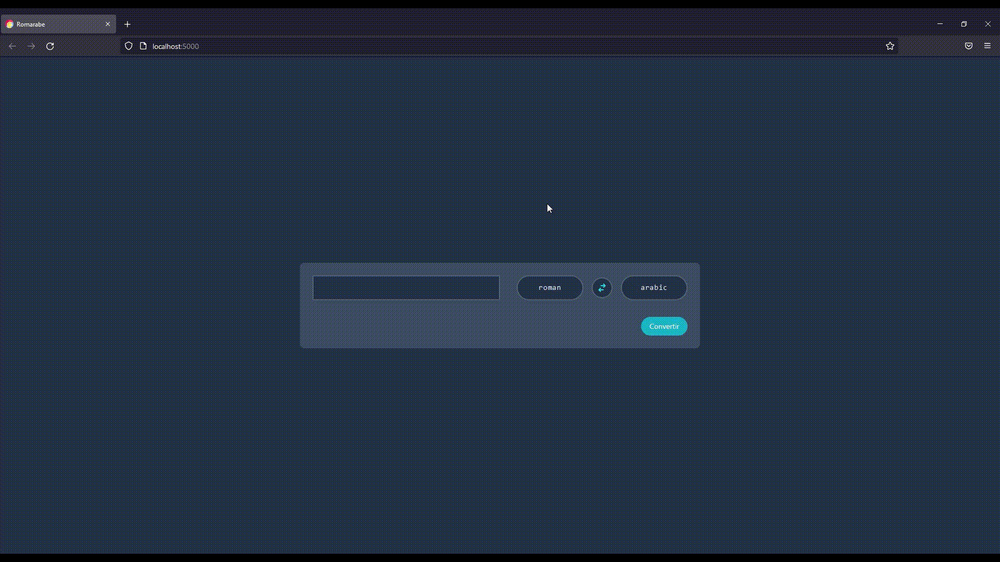

# Romarabe

Application JavaScript permettant de convertir des nombres romains en nombres arabes (et inversement).  

Démo :  



## Technologies

- Node Js - [Express](https://expressjs.com/fr/) coté serveur
- [React](https://fr.reactjs.org/) (avec [Vite](https://vitejs.dev/) en bundler) coté client
- [Jest](https://jestjs.io/fr/) pour tester les fonctions de conversion utilisées sur l'API.

## Installation

> Prérequis : une verison récente de Node Js

### Serveur

```bash
cd server/
npm install # ou yarn
npm run start # ou yarn start
```

### Client

```bash
cd client/
npm install # ou yarn
npm run build # ou yarn build
npx serve dist/
```
